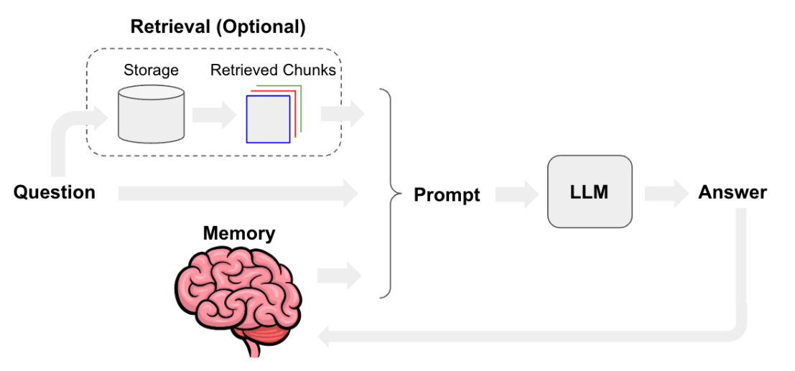
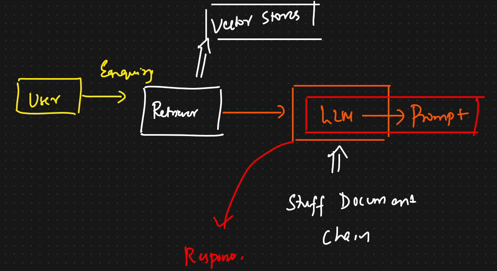
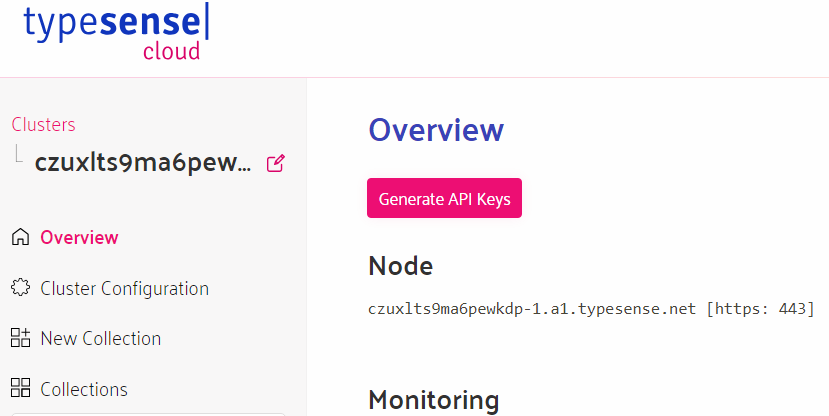

# RAG-Based Q&A Chatbot Pipeline Utilizing Langchain

## About RAG Application using Langchain Framework

Retrieval Augmented Generation is an LLM-based question answering system. This acts as a chatbot when used with Chainlit framework.
Let's look at the RAG pipeline architecture.

1. Load Source Data
- Load the data from multiple sources like text, pdfs, web based loaders, etc.
- Transform the data i.e divide it into chunks.
- Create Embeddings either using OpenAI/Ollama embeddings or any other.
2. Query Database
3. Retrieve most similar answer to the query.

## Detailed overview of the RAG Pipelining

1. Many data sources like pdfs, markdown files, text files, excel sheets, web content, image, etc are present and we need some Data Ingestion tools to load these information.

2. The first step in creation of the application is using data ingestion tools like text based loaders, pdf based loaders, web based loaders, etc. We use PyPDFLoader to load all the given pdfs.

3. Next, we transform the data i.e divide the data into smaller chunks so that we don't exceed the context size of the LLM models.

4. Use embeddings and convert the data chunks into vectors.

5. All these vectors are further stored in a vector store database like Typesense, Chroma, FAISS, etc.

6. Now we combine prompts along with chains and retrieval & get a response.

7. Vector store has some vectors and if we want any data from that, we can do similarity search but it is not effective. So, Retriever are used as an interface so that it has access to the vector store.

8. So, now we create a chain & retriever. Using these, we create a retriever chain where this chain takes in a user query, which is then passed to the retriever to fetch relevant documents. Those documents are then passed to an LLM to generate a response. 

## Steps to run the RAG Application

- Clone the repository
`git clone https://github.com/KareemullaAshrafAli/Q-A-RAG-Pipeline-with-Langchain.git`

- Install all the required libraries given in the requirements.txt file
`pip install -r requirements.txt`

- To start running the Typesense cloud server, visit [Typesense Cloud Cluster](https://cloud.typesense.org/clusters) to create a cluster and you will get a page as shown below.

- Now, click on generate API Keys, a text file with typesense admin key will be downloaded. Node name i.e host name is in the above picture (Ex : xxx.a1.typesense.net).

- Now, Create a .env file and add your OpenAI API key, Typesense Host and Typesense Admin API Key in it as follows
`
OPENAI_API_KEY = "enter_your_openai_api_key"
TYPESENSE_HOST = "enter_your_cloud_host_name"
TYPESENSE_API_KEY = "enter_your_admin_api_key"
`

- Run the below command to host chainlit user interface.
`chainlit run app.py -w`

## Response of LLM

